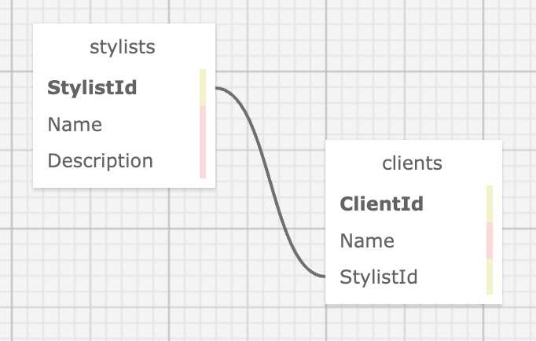

# _Eau Claire's Salon_

#### By _**Ian Bravo**_

#### _This web application will allow Claire, a hair salon owner, to manage her stylists and clients in an easy to use web application._

## GitHub Page ##

https://ian-bravo.github.io/HairSalon.Solution/


## Technologies Used

* _C# 10.0_
* _HtmL_
* _Bootstrap_
* _.Net 6.0_
* _ASP.NET Core MVC 6.0_
* _Entity Framework Core_
* _MySQL Community Server_
* _MySQL Workbench_


## Description

This C# web application will allow Claire to view her employees (stylists) and their respective clients. Claire will be able to add new stylists according to her staffing needs. Claire can select a specific stylist to view their specialties (description) along with their clients. Claire can also add new clients only after making a stylist to the web application. 

## Setup/Installation Requirements

Installing/Configuring MySQL and MySQL Workbench:

1. Follow the instructions on this <a href="https://www.learnhowtoprogram.com/c-and-net/getting-started-with-c/installing-and-configuring-mysql">page</a> for installing and configuring MySQL and MySQL Workbench

Cloning the Repo:
1. Open Terminal.
2. Change your directory to where you would want the cloned directory.
3. Input the following command into your terminal:  
 `$ git clone https://github.com/ian-bravo/HairSalon.Solution.git`
4. Using the terminal, navigate to the production directory: "HairSalon" and create a new file called appsettings.json
5. Within appsettings.json, put in the following code while also replacing the following values with your own values as shown below the code snippet:
```json
{
  "ConnectionStrings": {
      "DefaultConnection": "Server=localhost;Port=3306;database=[YOUR-DB-NAME];uid=[YOUR-USERNAME-HERE];pwd=[YOUR-PASSWORD-HERE];"
  }
}
```
* [YOUR-USERNAME-HERE] with your username
* [YOUR-PASSWORD-HERE] with your password
* [YOUR-DB-NAME] with the name of your database

Setup/Import the Database:
1. Within MySQL Workbench's Navigator > Administration window, select Data Import/Restore.
2. In Import Options select "Import from Self-Contained File".
3. Navigate to the `ian_bravo.sql` file within the cloned HairSalon.Solution repo. 
4. Under the 'Default Schema to be Imported To' section, select the New button.
5. Enter "[YOUR-DB-NAME]" and click OK. Replace "[YOUR-DB-NAME]" with the same name within your appsettings.json file
6. Navigate to the tab called Import Progress and click "Start Import" at the bottom right corner of the window.

Running the program:
1. Navigate to the project's production directory "Hair Salon" using the terminal.
2. Within the command line, run the command `dotnet watch run` to compile and execute the console application in developer mode.

## Schema



## Known Bugs

* _No known bugs_


## License

MIT License  

Copyright (c) 06-Oct-2023 Ian Bravo  

Permission is hereby granted, free of charge, to any person obtaining a copy of this software and associated documentation files (the "Software"), to deal in the Software without restriction, including without limitation the rights to use, copy, modify, merge, publish, distribute, sublicense, and/or sell copies of the Software, and to permit persons to whom the Software is furnished to do so, subject to the following conditions:  

The above copyright notice and this permission notice shall be included in all copies or substantial portions of the Software.  

THE SOFTWARE IS PROVIDED "AS IS", WITHOUT WARRANTY OF ANY KIND, EXPRESS OR IMPLIED, INCLUDING BUT NOT LIMITED TO THE WARRANTIES OF MERCHANTABILITY, FITNESS FOR A PARTICULAR PURPOSE AND NONINFRINGEMENT. IN NO EVENT SHALL THE AUTHORS OR COPYRIGHT HOLDERS BE LIABLE FOR ANY CLAIM, DAMAGES OR OTHER LIABILITY, WHETHER IN AN ACTION OF CONTRACT, TORT OR OTHERWISE, ARISING FROM, OUT OF OR IN CONNECTION WITH THE SOFTWARE OR THE USE OR OTHER DEALINGS IN THE SOFTWARE.


_For questions or concerns, please email me at bravo.ian@gmail.com_

